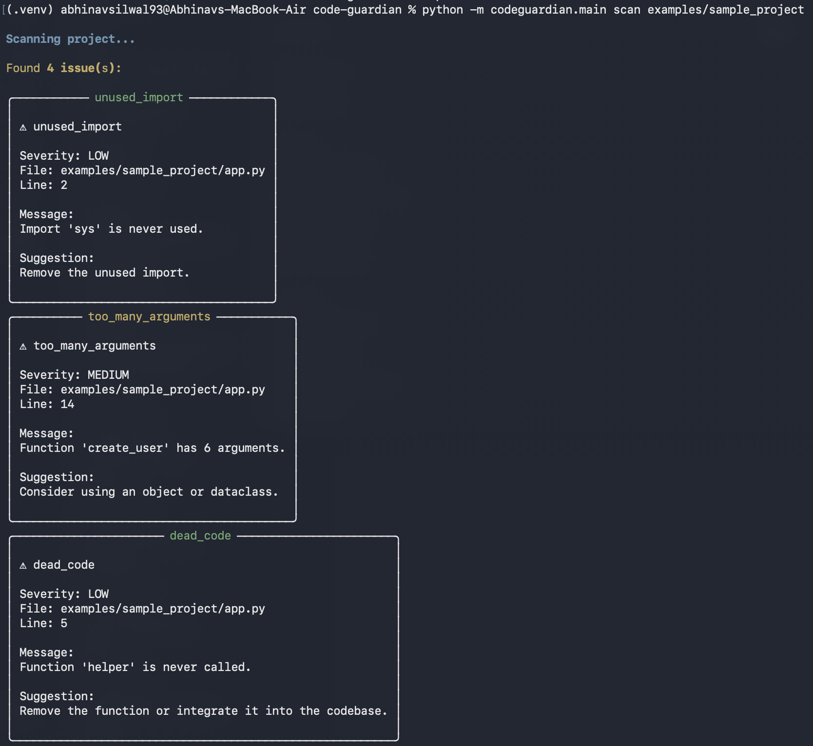
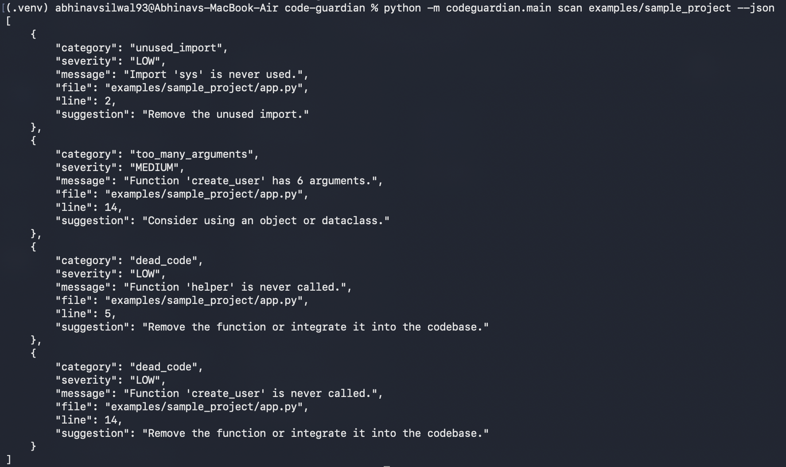

# 🛡️ CodeGuardian

AST-powered static code analysis tool for Python projects featuring configurable rules, dependency analysis, circular dependency detection, and JSON reporting.


## 🧠 Overview

CodeGuardian is a static analysis tool that helps developers identify common code quality issues before they become technical debt.

Instead of relying solely on style checkers, CodeGuardian parses Python source code using Python's Abstract Syntax Tree (AST) to detect structural issues such as unused imports, dead code, long functions, excessive function arguments, and circular dependencies.

The project is designed with a modular architecture that allows additional analyzers, reporting formats, and integrations to be added in future releases.

Version 1.0 focuses entirely on static analysis. Future versions will introduce a React dashboard, GitHub Pull Request integration, AI-assisted code reviews, and deployment as a GitHub App.


## 🚀 Features

### Static Analysis

- Detect unused imports
- Detect dead code
- Detect long functions
- Detect functions with too many parameters
- Build module dependency graphs
- Detect circular dependencies

### Configuration

- YAML configuration support
- Enable or disable individual rules
- Customize rule thresholds

### Reporting

- Rich terminal output
- JSON output for automation and CI pipelines
- Project summary reports

### Developer Experience

- Modular architecture
- Comprehensive pytest test suite
- Command-line interface powered by Typer


## 🛠 Technologies Used

- Python
- AST (Abstract Syntax Tree)
- Typer
- Rich
- PyYAML
- pytest


## 📦 How To Run

Clone the repository:
```bash
git clone https://github.com/AbhinavSilwal1/code-guardian.git
cd code-guardian
```

Create and activate virtual environment:
```bash
python3 -m venv .venv
source .venv/bin/activate
```

Install dependencies:
```bash
pip install -r requirements.txt
```

Set the Python module path:
```bash
export PYTHONPATH=src
```


## 📌 Current Commands

Scan a project:
```bash
python -m codeguardian.main scan path/to/project
```

Generate JSON output:
```bash
python -m codeguardian.main scan path/to/project --json
```

Use a custom configuration:
```bash
python -m codeguardian.main scan path/to/project --config custom.yml
```


## 📷 Example Output

### Rich Terminal Output



### JSON Output




## ⚙️ Configuration

CodeGuardian supports YAML configuration.

Example:
```yaml
rules:
  unused_import:
    enabled: true

  dead_code:
    enabled: true

  long_function:
    enabled: true
    max_lines: 75

  too_many_arguments:
    enabled: true
    max_arguments: 6

  circular_dependency:
    enabled: true
```


## 🔬 Testing

Run the complete test suite:
```bash
pytest
```

Current status: 27 passing tests.


## 🔑 License

This project is licensed under the MIT License. See the `LICENSE` file for details.