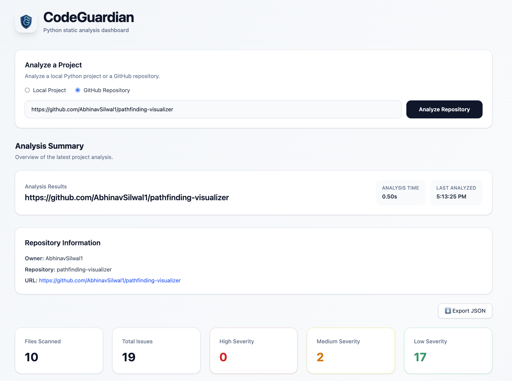
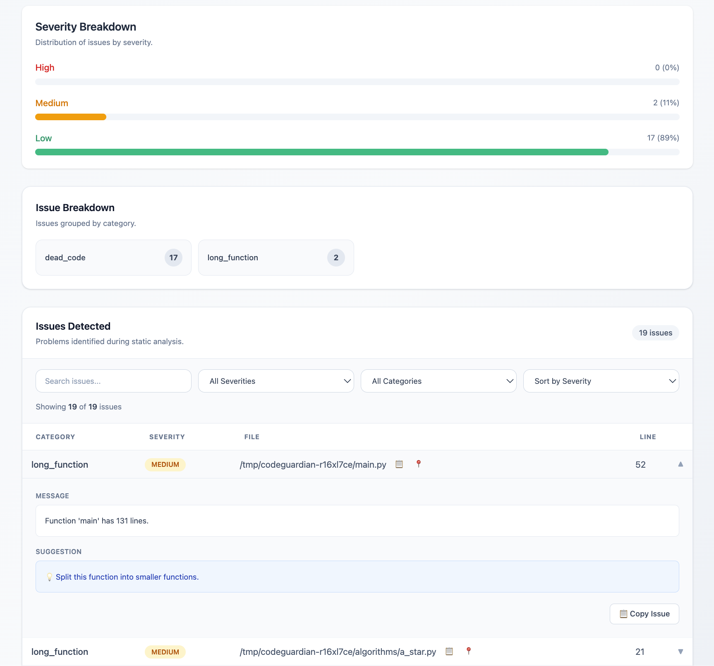

# 🛡️ CodeGuardian

AST-powered static analysis platform for Python projects featuring configurable analysis rules, dependency analysis, circular dependency detection, an interactive React + TypeScript dashboard, GitHub repository analysis, Docker deployment, and JSON reporting.


## 🧠 Overview

CodeGuardian is a static analysis platform that helps developers identify common code quality issues before they become technical debt.

The core analysis engine uses Python's Abstract Syntax Tree (AST) to detect structural issues such as unused imports, dead code, long functions, excessive function arguments, and circular dependencies.

Starting with version 1.1.0, CodeGuardian combines its static analysis engine with an interactive React + TypeScript dashboard powered by a FastAPI backend. Developers can analyze Python projects, review summary statistics, explore issues in detail, filter and sort results, and export complete analysis reports as JSON.

Starting with version 1.2.0, CodeGuardian also supports direct analysis of public GitHub repositories. Users can provide a GitHub repository URL directly through the dashboard, allowing CodeGuardian to clone and analyze the repository without requiring a local copy.

CodeGuardian can analyze any accessible Python project directory, including projects located outside the CodeGuardian repository itself.

The project is designed with a modular architecture that allows additional analyzers, reporting formats, and integrations to be added in future releases.


## 🚀 Features

### Static Analysis

- Detect unused imports
- Detect dead code
- Detect long functions
- Detect functions with too many parameters
- Build module dependency graphs
- Detect circular dependencies

### Interactive Dashboard

- Analyze Python projects through a React + TypeScript web interface
- Analyze projects located outside the CodeGuardian repository
- Analyze public GitHub repositories directly through the dashboard
- View project and repository metadata
- View project summary statistics
- View total files scanned and total issues detected
- View issue counts by severity
- Explore severity distribution through visual breakdowns
- Expand individual issues to view detailed messages and suggestions

### Analysis & Issue Management

- Search issues by relevant information
- Filter issues by severity
- Filter issues by category
- Sort issues by severity
- Expand and collapse individual issue details
- Copy file paths directly from issue results
- Copy file locations including line numbers
- Copy complete issue details for easier debugging and sharing
- Clear error messages for invalid, missing, or inaccessible projects and repositories
- Dedicated empty states for projects with no detected issues

### Reporting

- Rich terminal output
- JSON output for automation and CI pipelines
- Project summary reports
- Export complete dashboard analysis results as JSON

### Configuration

- YAML configuration support
- Enable or disable individual rules
- Customize rule thresholds

### Developer Experience

- Modular architecture
- FastAPI backend
- React + TypeScript frontend
- Dockerized application deployment
- Comprehensive pytest test suite
- Command-line interface powered by Typer
- Interactive dashboard powered by Tailwind CSS


## 🛠 Technologies Used

### Backend

- Python
- FastAPI
- AST (Abstract Syntax Tree)
- Typer
- Rich
- PyYAML
- GitPython

### Frontend

- React
- TypeScript
- Vite
- Tailwind CSS

### Deployment

- Docker

### Testing

- pytest


## 📦 How To Run

### Clone the Repository
```bash
git clone https://github.com/AbhinavSilwal1/code-guardian.git
cd code-guardian
```

### Run with Docker

CodeGuardian can be built and run as a single Docker container containing both the FastAPI backend and the production React frontend.

Make sure Docker Desktop is installed and running, then build the image from the project root:
```bash
docker build -t codeguardian .
```

Start the container:
```bash
docker run --rm -p 8000:8000 codeguardian
```

The CodeGuardian dashboard will be available at:
```text
http://localhost:8000
```

The FastAPI API documentation will be available at:
```text
http://localhost:8000/docs
```

To stop the application, press `Ctrl+C` in the terminal running the container.

### Analyze a Project

Open the CodeGuardian dashboard in your browser and enter the path to any accessible Python project directory.

For example:
```text
/Users/yourname/Projects/my-python-project
```

CodeGuardian can analyze projects located inside or outside the CodeGuardian repository.

### Analyze a GitHub Repository

Select **GitHub Repository** in the dashboard and enter the URL of a publicly accessible GitHub repository.

For example:
```text
https://github.com/user/project
```

CodeGuardian will clone the repository, analyze its Python files, and display the results directly in the dashboard.

The dashboard will display:

- Files scanned
- Total issues
- Issues by severity
- Severity breakdown
- Detailed issue results
- Repository metadata for GitHub analyses

You can then filter, sort, search, and inspect individual issues directly from the dashboard.


## 💻 CLI Usage

CodeGuardian's command-line interface remains available for terminal-based analysis and automation.

Scan a project:
```bash
python -m codeguardian.main scan path/to/project
```

Generate JSON output:
```bash
python -m codeguardian.main scan path/to/project --json
```

Use a custom configuration:
```bash
python -m codeguardian.main scan path/to/project --config custom.yml
```


## 📷 Dashboard

### Analysis Dashboard



### Issue Details




## ⚙️ Configuration

CodeGuardian supports YAML configuration for its static analysis engine.

Example:
```yaml
rules:
  unused_import:
    enabled: true

  dead_code:
    enabled: true

  long_function:
    enabled: true
    max_lines: 75

  too_many_arguments:
    enabled: true
    max_arguments: 6

  circular_dependency:
    enabled: true
```

Configuration settings apply to the underlying analysis engine used by CodeGuardian.


## 🔬 Testing

Run the complete test suite:
```bash
pytest
```

The v1.2.0 release includes a comprehensive automated test suite covering the CodeGuardian analysis engine, GitHub integration, and backend functionality.

The frontend production build can be verified with:
```bash
cd frontend
npm run build
```

The complete application can also be verified by building and running the Docker image:
```bash
docker build -t codeguardian .
docker run --rm -p 8000:8000 codeguardian
```


## 🔑 License

This project is licensed under the MIT License. See the `LICENSE` file for details.